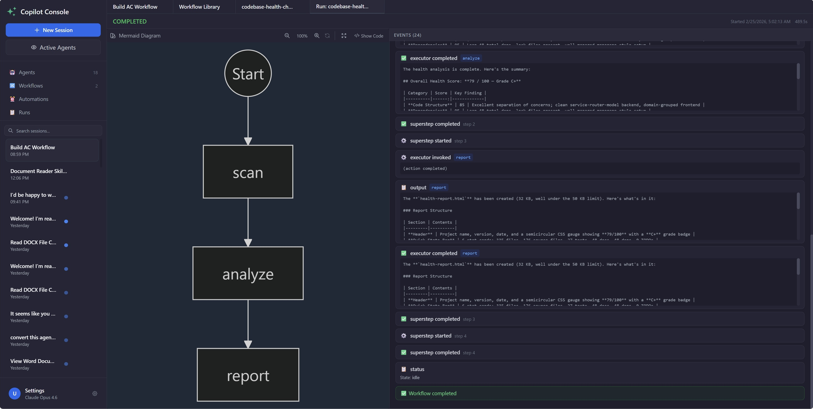
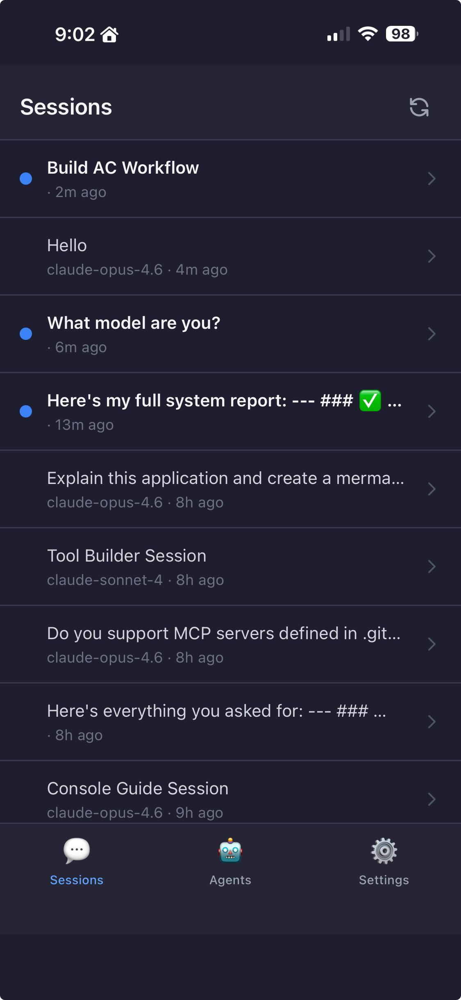

# Copilot Console

A locally running visual control center for interfacing, managing and automating GitHub Copilot agents through a rich web interface.


---

## What Is This?

Copilot Console is a visual management layer on top of [GitHub Copilot CLI](https://docs.github.com/en/copilot/github-copilot-in-the-cli). Built using [Copilot Python SDK](https://github.com/github/copilot-sdk) and [Microsoft Agent Framework](https://github.com/microsoft/agent-framework), it wraps the CLI's powerful agentic capabilities — orchestration, context management, built-in tools, multi-agents — in a modern browser interface with multi-session management, deterministic workflows, reusable agent personalities, scheduled automations, and external tool integration.

> **Platform:** Windows only (tested and developed on Windows 10/11). macOS/Linux are untested.

---

## Features

### 💬 Multi-Session Chat
Multiple conversations run simultaneously in a tabbed interface. Each session has its own context, model selection, tool configuration, sub-agent and working directory. Sessions persist across restarts.

### 🎨 Rich Message Rendering
Full Markdown with syntax-highlighted code blocks (Prism), GFM tables, Mermaid diagrams (with fullscreen view), and copy-to-clipboard. Responses render beautifully as they stream in real-time.

### 📎 File Attachments
Drag-and-drop or click to attach files to messages. Files are uploaded to the session and referenced by the agent.

### 🔔 Unread Indicators
Blue dot indicators highlight sessions with unread responses — no activity is missed across multiple parallel sessions.

### 🤖 Agent Library
Reusable agent personalities — each with its own model, system prompt, MCP servers, and custom tools. Every agent gets exactly the context it needs, nothing more. New sessions launch from any agent with one click.


### 🔍 Reasoning Transparency
Full visibility into the agent's reasoning process. Every tool call, file edit, and decision step is displayed in an expandable "Steps" panel — both during live streaming and in saved messages. See exactly what the agent did and why.

### 🤝 Agent Teams
Compose agents into teams. A main agent can delegate tasks to specialized sub-agents that run in separate contexts — each with its own prompt, tools, and MCP servers. The main agent automatically decides when to delegate based on the sub-agent's description. See [Agent Teams](docs/AGENT-TEAMS.md) for details.

### ⏰ Automations
Agents run on a cron schedule — configurable prompt, agent, and timing. The Runs dashboard shows all executions, with the ability to jump into a running agent's chat to watch it work live or review the full history later.

Example automations:
- Daily PR Review — Every morning at 8 AM, agent checks for open pull requests, summarizes their status, and flags if waiting for review for more than 2 days.


### 🔌 MCP Server Management
MCP servers can be defined globally (shared with CLI via `~/.copilot/mcp-config.json`) or app-only (`~/.copilot-console/mcp-config.json`). Individual servers and tools can be toggled on/off at both agent and session level — keeping context focused and avoiding bloat.

### 🔧 Custom Tools
Python tools dropped into `~/.copilot-console/tools/` become available to all agents. Each tool is defined with a `TOOL_SPECS` list containing name, description, JSON schema, and handler function. Tools auto-reload when files change — no restart needed. The built-in **Tool Builder** agent can generate custom tools from a natural language description — just describe what the tool should do.


### 🔀 Workflows
Multi-agent pipelines defined in YAML and powered by the [Microsoft Agent Framework](https://github.com/microsoft/agent-framework). Chain agents together — each step's output flows to the next. Run with a single click, watch events stream in real-time, and review run history with full traces.

Ships with sample workflows including **Codebase Health Check** (scanner → analyst → report generator) and **Emoji Poem** (poet → illustrator).



### 📱 Mobile Companion
Access Copilot Console from your phone — a purpose-built mobile UI served through a secure devtunnel. Monitor active agents, check unread messages with blue dot indicators, and reply to agents on the go. Install as a PWA home screen app for a native-like experience with push notifications when agents complete.



**Highlights:**
- **Pull-to-refresh** session list — no background polling
- **Push notifications** when agents finish (iOS & Android)
- **Live streaming** responses as the agent types
- **Unread indicators** sync across desktop and mobile
- **QR code setup** — scan from Settings, no manual URL entry

Start with `--expose`, scan the QR code, done. See [Mobile Companion](docs/MOBILE-COMPANION.md) for details.

---

## Quick Install

The install script checks prerequisites, installs any missing dependencies, and sets up Copilot Console — all in one command. Run the same command to upgrade.

**Windows (PowerShell):**
```powershell
irm https://raw.githubusercontent.com/sanchar10/copilot-agent-console/main/scripts/install.ps1 | iex
```

Then start:
```
copilot-console
```

> For manual setup, upgrading, or uninstalling, see **[Manual Installation](docs/INSTALL.md)**.

### First Things to Try

1. **Start a session** — Click `+` in the sidebar to create a new conversation.
2. **Chat** — Type a message and hit Enter. Responses stream in real-time.
3. **Create an agent** — Go to **Agents** in the sidebar, click **+ New Agent**, configure a name, system prompt, and model.
4. **Run a workflow** — Go to **Workflows**, open **Emoji Poem** or **Codebase Health Check**, click **▶ Run**, enter a topic, and watch the agents chain.
5. **Schedule an automation** — On an agent card, click **Automations**, then **+ New Automation** to set a cron schedule.
6. **Add custom tools** — Use the built-in **Tool Builder** agent to create tools via chat, or manually drop a `.py` file into `~/.copilot-console/tools/` (see [Custom Tools](docs/CUSTOM-TOOLS.md)).

---

## Command Line Options

```
copilot-console [OPTIONS]

Options:
  --port, -p PORT    Port to run the server on (default: 8765)
  --host HOST        Host to bind to (default: 127.0.0.1)
  --no-browser       Don't automatically open browser on start
  --no-sleep         Prevent Windows from sleeping while running
                     (useful when scheduled tasks need to run overnight)
  --expose           Enable remote access via devtunnel for mobile companion
  --allow-anonymous  Allow anonymous tunnel access (default: authenticated,
                     same Microsoft account only). Requires --expose.
  --version, -v      Show version and exit
```

### Examples

```powershell
# Run on a custom port
copilot-console --port 9000

# Run without opening browser
copilot-console --no-browser

# Keep PC awake for overnight scheduled tasks
copilot-console --no-sleep

# Enable mobile companion (secure — requires your Microsoft account)
copilot-console --expose

# Enable mobile companion (anonymous — anyone with the URL can connect)
copilot-console --expose --allow-anonymous
```

---

## Configuration

All data is stored in `C:\Users\<username>\.copilot-console\`:

```
.copilot-console\
├── settings.json        # Default model, working directory
├── sessions\            # Chat session history
├── agents\              # Agent library definitions
├── workflows\           # Workflow YAML definitions
├── workflow-runs\       # Workflow run history and working directories
├── automations\         # Automation definitions
├── task-runs\           # Automation run history
├── tools\               # Custom Python tools (drop .py files here)
├── mcp-servers\         # MCP server configurations
└── viewed.json          # Read/unread tracking
```

Custom tools can be created using the built-in **Tool Builder** agent or written manually. See [Custom Tools](docs/CUSTOM-TOOLS.md) for details.

---

## More Information

- [Manual Installation](docs/INSTALL.md) — Step-by-step setup, updating, and uninstalling
- [Packaged Samples](docs/SAMPLES.md) — Pre-built agents, workflows, and automations to try
- [Workflows](src/copilot_console/seed/copilot-console/docs/features/workflows.md) — Multi-agent pipelines with YAML
- [Custom Tools](docs/CUSTOM-TOOLS.md) — Creating tools with Tool Builder or manually
- [Agent Teams](docs/AGENT-TEAMS.md) — Composing agents with sub-agents
- [Mobile Companion](docs/MOBILE-COMPANION.md) — Phone access via secure tunnel
- [Troubleshooting](docs/TROUBLESHOOTING.md) — Common issues and SDK/CLI compatibility
- [Contributing](docs/CONTRIBUTING.md) — Development setup, building, testing, and architecture

---

## License

MIT
