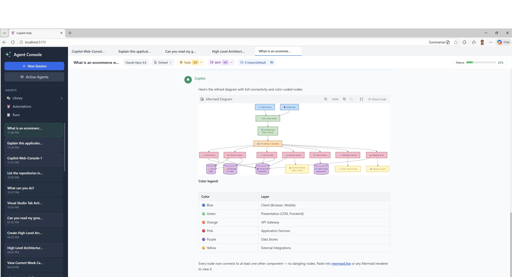
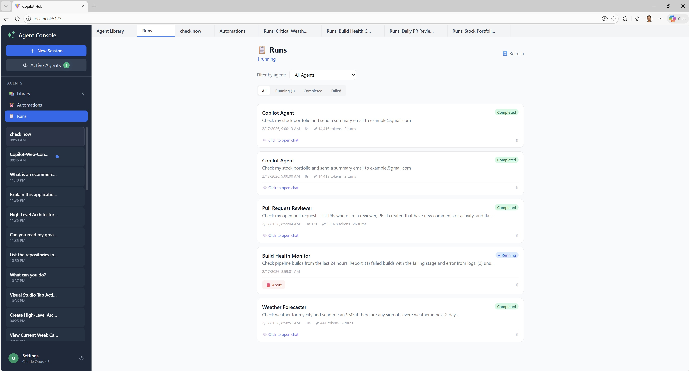

# Copilot Agent Console

**A personal AI agent console for GitHub Copilot.**

A desktop application providing a rich web interface for running, managing, and automating AI agents powered by GitHub Copilot — all locally.




---

## What Is This?

Copilot Agent Console is a rich experience built on top of the [GitHub Copilot CLI](https://docs.github.com/en/copilot/github-copilot-in-the-cli) and [Copilot Python SDK](https://github.com/github/copilot-sdk) that adds multi-session management, reusable agent personalities, scheduled automations, and external tool integration — all through a ChatGPT-style browser interface running locally on any machine.

It leverages Copilot's agentic capabilities — orchestration, context management, built-in tools — and provides a platform to extend them for different use cases through custom tools, MCP servers, and agent personalities.

> **Platform:** Windows only (tested and developed on Windows 10/11). macOS/Linux are untested.

---

## Features

### 💬 Multi-Session Chat
Multiple conversations run simultaneously in a tabbed interface. Each session has its own context, model selection, and tool configuration. Sessions persist across restarts.

### 🎨 Rich Message Rendering
Full Markdown with syntax-highlighted code blocks (Prism), GFM tables, Mermaid diagrams (with fullscreen view), and copy-to-clipboard. Responses render beautifully as they stream in real-time.

### 📎 File Attachments
Drag-and-drop or click to attach files to messages. Files are uploaded to the session and referenced by the agent.

### 🔍 Agent Transparency
Full visibility into the agent's reasoning process. Every tool call, file edit, and decision step is displayed in an expandable "Steps" panel — both during live streaming and in saved messages. See exactly what the agent did and why.

### 🤖 Agent Library
Reusable agent personalities — each with its own model, system prompt, MCP servers, and custom tools. Every agent gets exactly the context it needs, nothing more. New sessions launch from any agent with one click.


### ⏰ Automations
Agents run on a cron schedule — configurable prompt, agent, and timing. The Runs dashboard shows all executions, with the ability to jump into a running agent's chat to watch it work live or review the full history later.

**Example automations:**
- **Daily PR Review** — Every morning at 8 AM, an agent checks for open pull requests, summarizes their status, and flags any that have been waiting for review for more than 2 days.
- **Build Health Monitor** — Every hour during work days, an agent checks the CI pipeline for failed builds and reports which commits broke the build.



### 🔔 Unread Indicators
Blue dot indicators highlight sessions with unread responses — no activity is missed across multiple parallel sessions.

### 🔌 MCP Server Selection
MCP servers can be defined globally (shared with CLI via `~/.copilot/mcp-config.json`) or app-only (`~/.copilot-agent-console/mcp-config.json`). Individual servers and tools can be toggled on/off at both agent and session level — keeping context focused and avoiding bloat.

### 🔧 Custom Tools
Python tools dropped into `~/.copilot-agent-console/tools/` become available to all agents. Each tool is defined with a `TOOL_SPECS` list containing name, description, JSON schema, and handler function. Tools auto-reload when files change — no restart needed. The built-in **Tool Builder** agent can generate custom tools from a natural language description — just describe what the tool should do.

### 🔄 Smart Ralph AI Runner (Experimental)
Batch job execution based on the [Ralph Loop pattern](https://ghuntley.com/loop/). A dynamic list of jobs is built collaboratively and handed to Ralph Runner, which runs each one in a fresh agent session — preventing context bloat and isolating workflows.

---

## Pre-Requisites

Before installing Copilot Agent Console, ensure the following are available. All commands below can be run in either **PowerShell** or **Command Prompt**.

| Requirement | Version | How to check |
|---|---|---|
| **Windows** | 10 or 11 | — |
| **Python** | 3.10 or higher | `python --version` |
| **Node.js** | 18 or higher | `node --version` |
| **GitHub Copilot CLI** | 0.0.410+ | `copilot --version` |
| **GitHub Copilot subscription** | Active | [github.com/settings/copilot](https://github.com/settings/copilot) |

### Step 1: Install Python

Download from [python.org](https://www.python.org/downloads/). During installation, **check "Add Python to PATH"**.

Verify:
```powershell
python --version    # Should show 3.10+
pip --version       # Should work
```

### Step 2: Install Node.js

Download from [nodejs.org](https://nodejs.org/) (LTS version recommended).

Verify:
```powershell
node --version      # Should show 18+
npm --version       # Should work
```

### Step 3: Install GitHub Copilot CLI

The Copilot CLI is the runtime that Copilot Agent Console communicates with. Install it globally:

```powershell
npm install -g @github/copilot
```

Verify:
```powershell
copilot --version   # Should show 0.0.410 or later
```

Authenticate with GitHub (required before first use):
```powershell
copilot login
```

---

## Installation

### Option A: pipx (Recommended)

[pipx](https://pipx.pypa.io/) installs Python applications in isolated environments and automatically adds them to PATH.

```powershell
# Install pipx if not already installed
pip install --user pipx
python -m pipx ensurepath
# ⚠️ Close and reopen the terminal after this

# Install Copilot Agent Console
pipx install https://github.com/sanchar10/copilot-agent-console/releases/download/v0.1.0/copilot_agent_console-0.1.0-py3-none-any.whl
```

### Option B: pip

```powershell
pip install https://github.com/sanchar10/copilot-agent-console/releases/download/v0.1.0/copilot_agent_console-0.1.0-py3-none-any.whl
```

> If `agentconsole` command is not found after install, run as a module:
> ```powershell
> python -m copilot_agent_console.cli
> ```

### Verify Installation

```powershell
agentconsole --version
```

### Updating

When a new version is available, the app shows a banner with the install command. To update manually:

```powershell
pipx install --force https://github.com/sanchar10/copilot-agent-console/releases/download/v0.1.0/copilot_agent_console-0.1.0-py3-none-any.whl
```

### Uninstalling

```powershell
pipx uninstall copilot-agent-console
```

This removes the application but keeps session data and settings in `~/.copilot-agent-console/`. To remove everything:

```powershell
Remove-Item -Recurse -Force "$env:USERPROFILE\.copilot-agent-console"
```

---

## Quick Start

```powershell
# Launch Agent Console (opens browser automatically)
agentconsole
```

This starts a local server on `http://127.0.0.1:8765` and opens the browser.

### First Things to Try

1. **Start a session** — Click `+` in the sidebar to create a new conversation.
2. **Chat** — Type a message and hit Enter. Responses stream in real-time.
3. **Create an agent** — Go to **Agents** in the sidebar, click **+ New Agent**, configure a name, system prompt, and model.
4. **Schedule an automation** — On an agent card, click **Automations**, then **+ New Automation** to set a cron schedule.
5. **Add custom tools** — Drop a `.py` file with a `TOOL_SPECS` list into `~/.copilot-agent-console/tools/` (see [Custom Tools](#custom-tools)).

---

## Command Line Options

```
agentconsole [OPTIONS]

Options:
  --port, -p PORT    Port to run the server on (default: 8765)
  --host HOST        Host to bind to (default: 127.0.0.1)
  --no-browser       Don't automatically open browser on start
  --no-sleep         Prevent Windows from sleeping while running
                     (useful when scheduled tasks need to run overnight)
  --version, -v      Show version and exit
```

### Examples

```powershell
# Run on a custom port
agentconsole --port 9000

# Run without opening browser
agentconsole --no-browser

# Keep PC awake for overnight scheduled tasks
agentconsole --no-sleep
```

---

## Configuration

All data is stored in `C:\Users\<username>\.copilot-agent-console\`:

```
.copilot-agent-console\
├── settings.json        # Default model, working directory
├── sessions\            # Chat session history
├── agents\              # Agent library definitions
├── schedules\           # Automation schedules
├── task-runs\           # Automation run history
├── tools\               # Custom Python tools (drop .py files here)
├── mcp-servers\         # MCP server configurations
└── viewed.json          # Read/unread tracking
```

### Custom Tools

The easiest way to create a tool is with the built-in **Tool Builder** agent. Select it from the Agent Library, describe what the tool should do, and it handles the rest — generates the code, writes the file, verifies it loads, and runs a smoke test.

**Example:** _"Build a tool that gets the latest AI news"_ → Tool Builder creates `ai_news.py` in `~/.copilot-agent-console/tools/`, tests the import, calls the handler with sample data, and confirms everything works.

Tools can also be written manually. Each `.py` file in `~/.copilot-agent-console/tools/` needs a `TOOL_SPECS` list defining the tool schema and handler:

```python
# ~/.copilot-agent-console/tools/weather.py

def get_weather(city: str) -> str:
    """Get current weather for a city."""
    import requests  # always import inside the function
    resp = requests.get(f"https://wttr.in/{city}?format=3")
    return resp.text

TOOL_SPECS = [
    {
        "name": "get_weather",
        "description": "Get current weather for a city",
        "parameters": {
            "type": "object",
            "properties": {
                "city": {"type": "string", "description": "City name"}
            },
            "required": ["city"]
        },
        "handler": get_weather,
    }
]
```

Tools auto-reload when files change — new sessions pick them up without restarting.

---

## SDK / CLI Version Compatibility

Copilot Agent Console uses the [GitHub Copilot Python SDK](https://github.com/github/copilot-sdk) to communicate with the Copilot CLI. Both are installed automatically — no manual version management needed.

If you encounter errors like `unknown option '--headless'` or `protocol version mismatch`, reinstall Agent Console to get compatible versions:
```powershell
pipx install --force https://github.com/sanchar10/copilot-agent-console/releases/download/v0.1.0/copilot_agent_console-0.1.0-py3-none-any.whl
```

---

## Troubleshooting

### `agentconsole` command not found
- If installed with `pipx`: Run `pipx ensurepath` and **restart the terminal**
- If installed with `pip`: Try `python -m copilot_agent_console.cli`
- Verify Python's Scripts directory is in PATH: `$env:PATH -split ';' | Select-String Python`

### "github-copilot-sdk not found"
The SDK should be installed automatically as a dependency. If it's missing:
```powershell
pipx inject copilot-agent-console github-copilot-sdk
```

### Agent not responding to messages
The Copilot CLI must be authenticated before Agent Console can use it:
1. Ensure an active [GitHub Copilot subscription](https://github.com/settings/copilot) is in place
2. Run `copilot login` in a terminal and complete the device code flow
3. Restart Agent Console

### Scheduled tasks don't run when PC is sleeping
Use the `--no-sleep` flag to prevent Windows from going to sleep:
```powershell
agentconsole --no-sleep
```
This only prevents idle sleep — manual sleep is still possible.

### Port already in use
```powershell
agentconsole --port 9000
```

---

## Development

For contributors who want to modify the code.

### Prerequisites

- Python 3.10+
- Node.js 18+
- GitHub Copilot CLI 0.0.410 (see [Pre-Requisites](#pre-requisites))

### Setup

```powershell
# Clone the repo
git clone https://github.com/sanchar10/copilot-agent-console.git
cd copilot-agent-console

# Install all dependencies (frontend + backend)
npm run setup

# Start in development mode (hot reload for both frontend and backend)
npm run dev
```

- Frontend: http://localhost:5173 (Vite dev server with HMR)
- Backend: http://localhost:8765 (FastAPI with auto-reload)

### Building the Package

```powershell
# Build frontend
npm run build

# Build Python wheel
pip install build
python -m build --wheel

# Output: dist\copilot_agent_console-0.1.0-py3-none-any.whl
```

### Running Tests

```powershell
# Backend tests
python -m pytest

# Frontend tests
npm test --prefix frontend
```

### Architecture

| Layer | Technology |
|---|---|
| Frontend | React, TypeScript, Vite, Tailwind CSS, Zustand |
| Backend | Python, FastAPI, Uvicorn |
| AI Runtime | GitHub Copilot SDK → Copilot CLI |
| Streaming | Server-Sent Events (SSE) |
| Scheduling | APScheduler |
| Storage | JSON files (no database) |

---

## License

MIT
