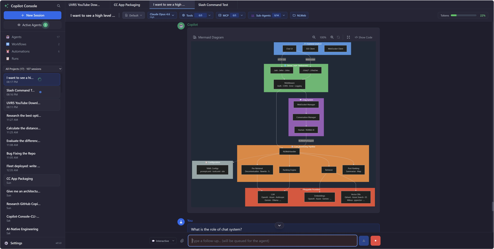
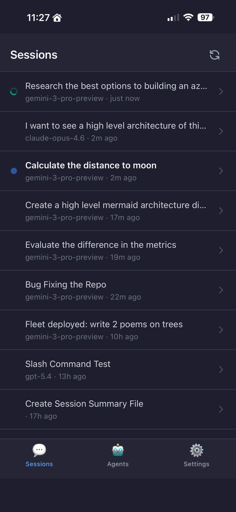

# Copilot Console

> **Copilot CLI, organized.** A friendly visual front-end for [GitHub Copilot CLI](https://docs.github.com/en/copilot/github-copilot-in-the-cli) — every session in one window, with per-task MCP servers, agents, and workflows. Plus a phone view of the whole console. Copilot CLI still does all the real work; Console just makes it nicer to live in.




<!-- TODO(launch): replace the static screenshot above with a 5–10s looping GIF showing
     (1) four sessions in the sidebar, (2) clicking to switch, (3) per-session context
     panel changing. Recording: see docs/launch/demo-checklist.md -->

> 🌐 **[Visit the Copilot Console website →](https://sanchar10.github.io/copilot-console)** for a full feature showcase with screenshots and demos.

### Why you might want this

Originally built as a personal toolkit on top of the Copilot SDK, kept open as a reference for what's buildable. Copilot CLI is great — but by Wednesday afternoon you have 10 sessions open across 5 repos, you're not sure which terminal asked which question, and switching between them is terminal-tab gymnastics. If any of these match how you actually work, you're welcome to it:

- 🪟 **Every session in one window** — click to switch, see what each one is doing at a glance
- 🧰 **Per-session context** — different MCP servers, agents, models, and working directory per task
- 🔁 **Workflows & automations** — chain agents, schedule runs, repeat the boring stuff
- 🔍 **Find what you did last week** — search across every past session, pin responses with notes
- 📱 **All your CLI sessions on your phone** — every session auto-discovered, push notifications when any agent finishes (Console-initiated **or** native CLI)

> **Pairs well with `/remote`:** GitHub's built-in [`/remote`](https://docs.github.com/en/copilot/how-tos/copilot-cli/use-copilot-cli/steer-remotely) is great for steering a session from GitHub Mobile when you need to. Copilot Console mobile is for the times you want a list of *every* CLI session — Console-launched and native terminal alike — with push notifications when any one of them finishes or needs you. Different jobs; use whichever fits the moment.

> **Looking for the official desktop app?** GitHub now ships an [official Copilot desktop app](https://github.com/github/app) — a polished, visual, agentic development experience with native GitHub and PR-lifecycle integration. If that fits what you need, grab it. This project is a personal toolkit kept open-source as a reference for what's buildable on the Copilot SDK.

Built on the [Copilot SDK](https://github.com/github/copilot-sdk). Open source, MIT-licensed, one-line install, runs locally. **Platform:** Windows, macOS, Linux (Ubuntu 22.04+).

---

## Full feature list

| | Feature | Description |
|---|---|---|
| 🖥️ | **Visual Session Management** | Multiple sessions in a tabbed interface with per-session context management: system prompt, model, tools, MCP servers, agents, and working directory |
| 🔀 | **Workflows** | Multi-agent YAML pipelines using [Microsoft Agent Framework](https://github.com/microsoft/agent-framework) — see the workflow as a Mermaid diagram. Branch, loop, pause for human input. See [docs/guides/WORKFLOWS.md](docs/guides/WORKFLOWS.md). |
| ⚡ | **Slash Commands** | Type `/` for command palette — `/fleet` fires parallel sub-agents, `/compact` compresses context, `/agent` picks the primary agent persona for the session. Inline chips with auto-complete |
| ⏰ | **Automations** | Cron-scheduled agent runs with a Runs dashboard and live session access |
| 📂 | **Project Facilitation** | Folder-based session filtering, cross-session search with keyword highlighting, pin responses with notes |
| 🤖 | **Agent Library** | Reusable agent personalities with custom prompts, models, tools, and MCP servers |
| 🤝 | **Agent Teams** | Compose agents into teams with automatic delegation to specialized sub-agents |
| 🌐 | **Agentic Web Browsing** | Autonomous web navigation via bundled Playwright MCP server |
| 🔌 | **MCP Servers** | Add, edit, enable, and delete MCP servers from Settings — sensible defaults auto-enabled on first install. Per-session server / tool toggling. OAuth sign-in with auto-recovery when tokens expire. See [docs/guides/MCP-SERVERS.md](docs/guides/MCP-SERVERS.md) |
| 🔧 | **Custom Tools** | Drop Python functions into `~/.copilot-console/tools/` to easily create selectable agent tools. Built-in **Tool Builder** agent scaffolds new tools for you |
| 📎 | **Files & Images** | Drag-and-drop files and paste images into messages to give agents visual and textual context |
| 🎨 | **Rich Rendering** | Markdown, syntax highlighting, Mermaid diagrams, streaming, reasoning steps |
| 💬 | **Interactive Q&A** | Agents ask structured questions when they need input — works on desktop and mobile |
| 🔔 | **Desktop Notifications** | Get notified when agents finish or need your input, even from native CLI sessions |
| 📂 | **Open With** | Quickly open project folders in VS Code, Terminal, or File Explorer |

---

## 📱 Mobile — every CLI session on your phone

Every Copilot CLI session — Console-launched **and** native terminal — visible on your phone the moment it starts. Push notifications when any agent finishes or asks a question. Reply from the chat view. Installable as a PWA.



Start Copilot Console with `--expose --no-sleep`, scan the QR code from Settings on your phone, and you're set. See [Mobile Companion](docs/guides/MOBILE-COMPANION.md).

---

## 🔔 Copilot CLI Session Notifications

**Works for native CLI sessions.** Get notified on your phone when *any* Copilot CLI terminal session finishes. Continue the conversation from mobile.


Enable via `cli-notify on` from the command line, or toggle in Console Settings. A standalone feature for CLI users even without using Console.

---

## Quick Install

One command to install (or upgrade):

**Windows:**
```powershell
irm https://raw.githubusercontent.com/sanchar10/copilot-console/main/scripts/install.ps1 | iex
```

**macOS / Linux:**
```bash
curl -fsSL https://raw.githubusercontent.com/sanchar10/copilot-console/main/scripts/install.sh | bash
```

Then start:
```
copilot-console
```

> For manual setup, upgrading, or uninstalling, see **[Manual Installation](docs/guides/INSTALL.md)**.

### First Things to Try

1. **Start a session** — Click `+` in the sidebar to create a new conversation.
2. **Try Fleet Mode** — Type `/fleet analyze this codebase for security issues` to fire parallel sub-agents.
3. **Pin a response** — Hover over an agent response and click 📌 to save it with an optional note. Browse pins from the drawer.
4. **Search across sessions** — Use the search bar in the sidebar to find anything across all conversations.
5. **Create an agent** — Go to **Agents**, click **+ New Agent**, configure a system prompt, model, and tools.
6. **Build a micro-app** — Go to **Agents** → **Dev Lead** → **New Session**, pick a starter prompt, and watch a 6-agent team build a full-stack app.
7. **Run a workflow** — Go to **Workflows**, open **Mood Topic Poem** or **Codebase Health Check**, click **▶ Run**.
8. **Go mobile** — Run `copilot-console` with `--expose`, scan the QR code from Settings on your phone, and continue from anywhere.
9. **Ask the Console Guide** — Start a session with the built-in 📖 **Copilot Console Guide** agent from the Agent Library. Ask it anything about features, setup, or troubleshooting — it reads the bundled docs to give you accurate answers.

---

## Command Line Options

```
copilot-console [OPTIONS]

Options:
  --port, -p PORT    Port to run the server on (default: 8765)
  --host HOST        Host to bind to (default: 127.0.0.1)
  --no-browser       Don't automatically open browser on start
  --no-sleep         Prevent system from sleeping while running
                     (Windows: SetThreadExecutionState, macOS: caffeinate)
  --expose           Enable remote access via devtunnel for mobile companion
  --allow-anonymous  Allow anonymous tunnel access (token-secured, no login on phone). Recommended only for testing. Requires --expose.
  --version, -v      Show version and exit
```

### Examples

```shell
# Run on a custom port
copilot-console --port 9000

# Run without opening browser
copilot-console --no-browser

# Keep system awake for overnight scheduled tasks
copilot-console --no-sleep

# Enable mobile companion (secure — requires same Microsoft work/school account on phone)
copilot-console --expose

# Enable mobile companion (anonymous — token-secured, no login on phone)
copilot-console --expose --allow-anonymous
```

---

## Configuration

All data is stored in `~/.copilot-console/`:

```
.copilot-console/
├── settings.json        # Default model, working directory
├── mcp-config.json      # MCP server configurations (global)
├── sessions/            # Session metadata and settings
├── agents/              # Agent library definitions
├── workflows/           # Workflow YAML definitions
├── workflow-runs/       # Workflow run history and working directories
├── automations/         # Automation definitions
├── task-runs/           # Automation run history
├── tools/               # Custom Python tools (drop .py files here)
├── mcp-servers/         # Drop-in MCP server scripts (stdio / local)
├── logs/                # Application logs
└── viewed.json          # Read/unread tracking
```

---

## More Information

- [Manual Installation](docs/guides/INSTALL.md) — Step-by-step setup, updating, and uninstalling
- [Sessions](docs/guides/SESSIONS.md) — Tabs, modes, attachments, and persistence
- [Agent Library](docs/guides/AGENT-LIBRARY.md) — Creating agents and launching sessions
- [Agent Teams](docs/guides/AGENT-TEAMS.md) — Composing agents with sub-agents
- [Workflows](docs/guides/WORKFLOWS.md) — Multi-agent YAML pipelines
- [Automations](docs/guides/AUTOMATIONS.md) — Cron-driven agent runs
- [MCP Servers](docs/guides/MCP-SERVERS.md) — Configuring and toggling MCP servers
- [Custom Tools](docs/guides/CUSTOM-TOOLS.md) — Creating tools with Tool Builder or manually
- [Mobile Companion](docs/guides/MOBILE-COMPANION.md) — Phone access via secure tunnel
- [Packaged Samples](docs/guides/SAMPLES.md) — Pre-built agents, workflows, and automations
- [Troubleshooting](docs/guides/TROUBLESHOOTING.md) — Common issues and compatibility
- [Known Limitations](docs/guides/KNOWN-LIMITATIONS.md) — Current limitations and workarounds
- [Contributing](docs/guides/CONTRIBUTING.md) — Development setup, building, and testing

---

## License

MIT
