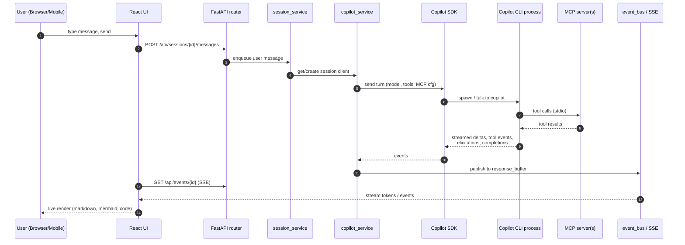

# Copilot Console — Architecture

High-level architecture of Copilot Console: a local web app that wraps the GitHub Copilot CLI / SDK and adds session management, agents, workflows, automations, MCP servers, search, and a mobile companion.

## System diagram

```mermaid
flowchart TB
    %% ===== Clients =====
    subgraph Clients["👥 Clients"]
        Browser["Desktop Browser<br/>(localhost:8765)"]
        Mobile["📱 Mobile PWA<br/>(via devtunnel)"]
        NativeCLI["Native Copilot CLI<br/>(cli-notify hooks)"]
    end

    %% ===== Tunnel =====
    Tunnel["🔐 devtunnel<br/>(--expose, token auth)"]
    Mobile -.->|HTTPS| Tunnel

    %% ===== Frontend =====
    subgraph FE["🖥️ Frontend — React 19 + Vite + TS + Tailwind"]
        direction TB
        UI["App.tsx / Components<br/>(sessions, agents, workflows,<br/>automations, MCP, search, pins)"]
        MobileUI["mobile/ views"]
        Stores["Zustand stores"]
        APIClient["api/ client<br/>(fetch + SSE)"]
        UI --> Stores
        MobileUI --> Stores
        Stores --> APIClient
    end

    Browser --> FE
    Tunnel --> FE

    %% ===== Backend =====
    subgraph BE["⚙️ Backend — FastAPI (Python 3.11+) · uvicorn"]
        direction TB

        subgraph MW["Middleware"]
            CORS["CORS"]
            GZip["SelectiveGZip<br/>(skips SSE)"]
            Auth["TokenAuthMiddleware<br/>(bearer for non-localhost)"]
        end

        subgraph Routers["Routers (/api/*)"]
            direction LR
            R1["sessions · events<br/>agents · models"]
            R2["workflows · automations<br/>task_runs"]
            R3["mcp · tools · settings<br/>filesystem · projects"]
            R4["search · pins · viewed<br/>logs · help · push"]
            R5["auth · cli_hooks"]
        end

        subgraph Services["Services"]
            direction TB
            CopilotSvc["copilot_service<br/>(SDK client mgr)"]
            SessionSvc["session_service<br/>+ session_client"]
            EventBus["event_bus +<br/>event_processor +<br/>response_buffer"]
            AgentSvc["agent_storage /<br/>agent_discovery"]
            MCPSvc["mcp_service +<br/>mcp_oauth_coordinator"]
            ToolsSvc["tools_service<br/>(custom Python tools)"]
            WFEngine["workflow_engine +<br/>workflow_run_service +<br/>workflow_storage"]
            AutoSvc["automation_service +<br/>task_runner_service<br/>(APScheduler cron)"]
            SearchSvc["search_service"]
            PinSvc["pin_storage"]
            PushSvc["push_service<br/>(Web Push / VAPID)"]
            NotifMgr["notification_manager"]
            Elicit["elicitation_service<br/>(structured Q&A)"]
            HelpSvc["help_service +<br/>seed_service"]
            Storage["storage_service<br/>(JSON files)"]
            LogSvc["logging_service"]
        end

        Routers --> Services
        MW --> Routers
    end

    APIClient -->|REST + SSE| MW

    %% ===== External / SDK =====
    subgraph External["🔌 External integrations"]
        direction TB
        SDK["github-copilot-sdk 0.3.0"]
        AF["agent-framework 1.0rc2 +<br/>agent-framework-github-copilot +<br/>agent-framework-declarative"]
        CopilotCLI["GitHub Copilot CLI<br/>(subprocess)"]
        MCPServers["MCP servers<br/>(stdio / HTTP / OAuth)<br/>incl. Playwright"]
        WebPush["Web Push services<br/>(FCM/APNs)"]
    end

    CopilotSvc --> SDK
    SessionSvc --> SDK
    SDK --> CopilotCLI
    WFEngine --> AF
    AF --> SDK
    MCPSvc --> MCPServers
    CopilotCLI --> MCPServers
    PushSvc --> WebPush
    WebPush -.->|notifications| Mobile
    NativeCLI -->|hook events| R5

    %% ===== Storage =====
    subgraph Disk["💾 ~/.copilot-console/"]
        direction LR
        D1["sessions/"]
        D2["agents/"]
        D3["workflows/<br/>workflow-runs/"]
        D4["automations/<br/>task-runs/"]
        D5["mcp-config.json<br/>mcp-servers/"]
        D6["tools/"]
        D7["pins · viewed.json<br/>settings.json · logs/"]
    end

    Storage --> Disk
    SessionSvc --> D1
    AgentSvc --> D2
    WFEngine --> D3
    AutoSvc --> D4
    MCPSvc --> D5
    ToolsSvc --> D6
    PinSvc --> D7

    %% ===== Static frontend served by backend =====
    BE -.->|serves built SPA<br/>from static/| Browser

    classDef ext fill:#fef3c7,stroke:#b45309
    classDef store fill:#dbeafe,stroke:#1e40af
    classDef svc fill:#ede9fe,stroke:#5b21b6
    class External,SDK,AF,CopilotCLI,MCPServers,WebPush ext
    class Disk,D1,D2,D3,D4,D5,D6,D7 store
    class Services svc
```



## Request lifecycle (chat turn)



## Key architectural choices

- **Single FastAPI process** serves the bundled React SPA (from `static/`) and the `/api` REST + SSE endpoints — one port, one install.
- **GitHub Copilot CLI is the engine.** `copilot_service` manages a long-lived SDK client; per-session `session_client` instances hold per-task context (model, working dir, MCP servers, tools, agent persona).
- **SSE for streaming** with a `SelectiveGZipMiddleware` that compresses normal responses but skips event streams so tokens flow in real-time.
- **Workflows** run on Microsoft Agent Framework (`workflow_engine`) — pinned versions because `agent-framework-github-copilot` hard-pins SDK versions (see comments in `pyproject.toml`).
- **Automations** use APScheduler inside `automation_service`, executing through `task_runner_service` against the same Copilot pipeline.
- **MCP** servers are configured globally and toggled per-session; `mcp_oauth_coordinator` handles OAuth re-auth flows. Custom Python tools are loaded from `~/.copilot-console/tools/`.
- **Mobile companion** = same SPA served over a `devtunnel` (`--expose`), protected by `TokenAuthMiddleware`. Push notifications via VAPID Web Push (`push_service`).
- **Native CLI integration**: `cli-notify` hooks post events to `/api/cli_hooks`, so notifications work even without Console sessions.
- **Storage is plain JSON on disk** under `~/.copilot-console/` — no database, easy to inspect and back up.

## Repository layout

```
src/copilot_console/
  cli.py, cli_notify.py        # entry points
  app/
    main.py                    # FastAPI app, lifespan, static serving
    config.py
    middleware/                # auth, selective gzip
    routers/                   # HTTP/SSE endpoints
    services/                  # business logic + integrations
    models/                    # pydantic schemas
  seed/                        # bundled agents, workflows, docs
frontend/
  src/{components,mobile,stores,api,hooks,utils,types}
  dist/  → copied into src/copilot_console/static/ at build time
```
